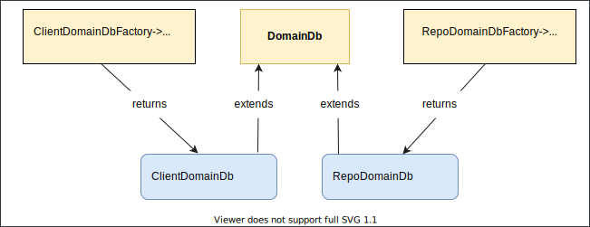

# DomainDb Database Connection Abstraction

The DomainDb abstraction makes it possible to receive an instance of a DB connection without having to inject multiple classes into a service as would otherwise be needed to have access to the same functionality. It allows us to abstract the different load balancing and DB groups aspect of DB connection, making working with DB connections far less prone to errors.
This abstraction also allows us to typehint the type of connection we want to obtain (Client/Repo) which makes our code easier to read and review.

## How the abstraction is structured

The DomainDb wrapper uses the LoadBalancerFactory and the ConnectionManager to allow DB access. This wrapper is then extended by the corresponding classes ClientDomainDb() and RepoDomainDb().
The RepoDomainDbFactory class contains (among others) a newRepoDb() method, with which an Instance of RepoDomainDb() is obtained for the injected service.



## Using the abstraction

[Here is a usage example](https://gerrit.wikimedia.org/g/mediawiki/extensions/Wikibase/+/e9b7f5c68feb76923f81f1271df6f2776898ea8b/client/maintenance/updateSubscriptions.php#68) for getting both a Client and a Repo connection:
```
	$clientDb = WikibaseClient::getClientDomainDbFactory()->newLocalDb();
	$repoDb = WikibaseClient::getRepoDomainDbFactory()->newRepoDb();
```
[Here is another example](https://gerrit.wikimedia.org/g/mediawiki/extensions/Wikibase/+/e9b7f5c68feb76923f81f1271df6f2776898ea8b/lib/includes/Store/Sql/Terms/CleanTermsIfUnusedJob.php#45) using service wiring:
```
	$repoDomainDb = MediaWikiServices::getInstance()
		->get( 'WikibaseRepo.RepoDomainDbFactory' )
		->newRepoDb();
```