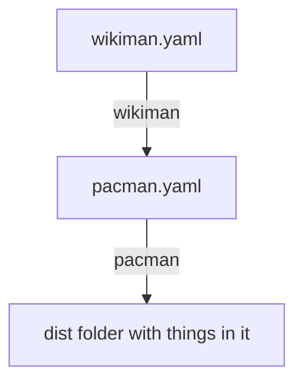

## Build scripts

### Overview


### sync.sh

This script will resync the `dist` directory.

This is made up of a series of steps:

- Empty the `dist` directory entirely
- `pacman`: Retrieive and build MediaWiki code, remove any bloat files that are not needed
- `sync_dist-persist.sh`: Sync the `dist-persist` directory into `dist` (Custom & extra wbstack hooks, config, and files)
- `04-docker-compose`: Perform a composer install
- `05-docker-entrypoint-overrides`: Add the WBStack shims to MediaWiki entrypoints

Assuming neither `dist-persist` directory or `pacman.yaml` have changed then running this script should almost be a no-op. The only files we expect to change are composer autoload files and composer's own vendor folder.

There is a GitHub Action [Workflow](../.github/workflows/wbstack.sync.check.yml) running to attempt to ensure that `sync.sh` has been run on every commit so that the dist directory does not get out of sync from what it is built from.

### wikiman & pacman

`wikiman` is a MediaWiki specific yaml generator for pacman.
This needs to be run by developers when updating component versions in `wikiman.yaml`

`pacman` is a generic tool using yaml to fetch a series of codebases and place them on disk.
This is run as a step in `sync.sh`

#### Syncing patches
To apply additional gerrit patches, you can specify patch URLs in the corresponding codebase part of `pacman.yaml`

Example:
```
- name: Wikibase
  patchUrls:
  - https://gerrit.wikimedia.org/r/changes/mediawiki%2Fextensions%2FWikibase~833742/revisions/15/patch?download
```

**please note**: currently these will get overridden if `wikiman` is used to generate the file!
